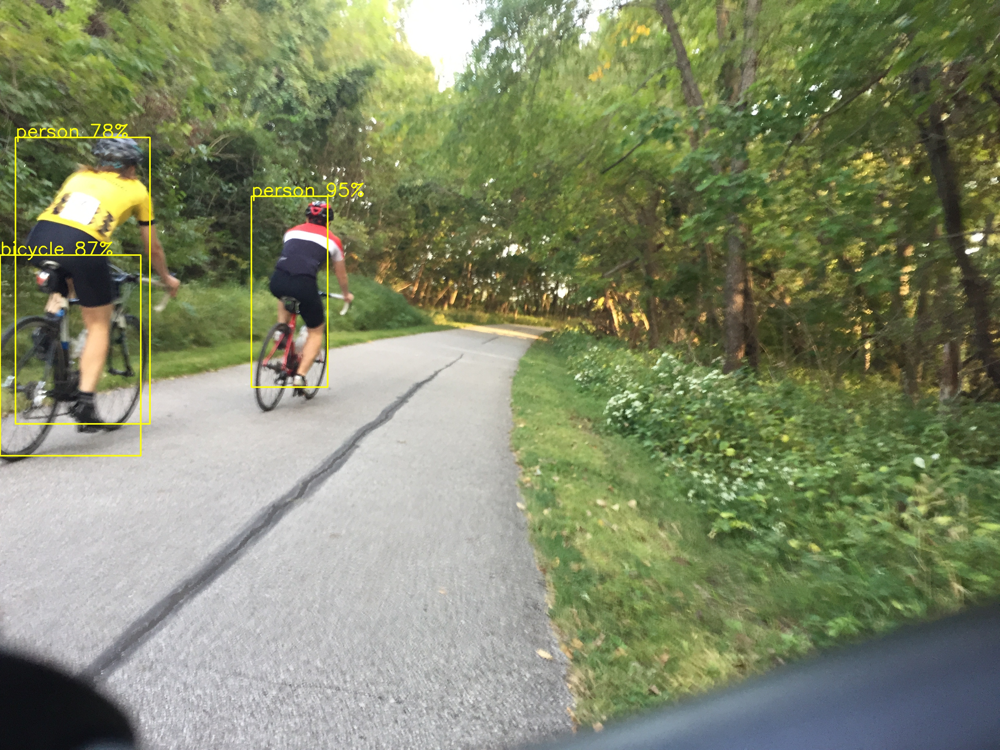

# edgetpu-minimal

[](https://github.com/jambamamba/leila.docker)


A minimum executable that loads libedgetpu library and is able to check the version of the [Coral Edge TPU](https://coral.ai/products/accelerator/) attached to a USB port.

### Requirement

Build and install the [docker.leila image](https://github.com/jambamamba/docker.leila). Then run the container:

```bash
git clone https://github.com/jambamamba/docker.leila.git
cd docker.leila
./build.sh
./enterdocker.sh
```
password is dev

### Build

After you enter the docker container, clone this repo and run the build.sh script:

```bash
git clone https://github.com/jambamamba/edgetpu-minimal.git
cd edgetpu-minimal 
./build.sh 
```

### Run

If all goes well, the build.sh will generate the executable in the build folder. You can run it like this:

```bash
./build/minimal
```
If you have the Coral USB accelerator plugged in, you should see this:

```bash
tf-docker ~/oosman/repos/edgetpu-minimal > ./build/minimal 
available_tpus.size: 1
INFO: Initialized TensorFlow Lite runtime.
Done
```

### Cross Compile for Raspberry Pi Zero

First build the Raspberry Pi Zero toolchain

```bash
git clone https://github.com/jambamamba/crosstool-ng.git
cd crosstool-ng
git checkout raspi0
./build.sh
```

This can take some time, go take a long shower meanwhile, you haven't done it for a while, and you don't smell so good!

```bash
cd edgetpu-minimal 
./build.sh arch=rpi
```

### Clean builds

```bash
./build.sh clean=true arch=host
./build.sh clean=true arch=rpi
```

### Object Classification

```bash
./build/classify cat224x224.rgb
```

The input file (cat.rgb) must be 224 x 224 raw RGB image.

You can use the convert utility to make RGB file like this:
```bash
convert cat.bmp -resize 224x224! cat.rgb
```

#### Output:
```bash
available_tpus.size: 1
INFO: Initialized TensorFlow Lite runtime.
Inferenced class "Persian cat" in 12 milliseconds
```

### Object Detection

```bash
./build/detect /path/to/cat.jpg
```

Note that you can pass in any size jpg or png file as input.

#### Output:
```bash
available_tpus.size: 1
INFO: Initialized TensorFlow Lite runtime.
Inferenced class "cat" at (1,14)=> (296,227) in 30 milliseconds
```

An output file is generated with bounding boxes around the detected objects.

